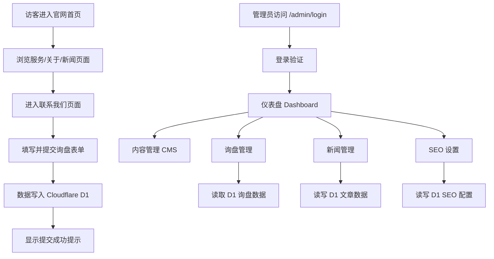

# NexShore Technologies 海外官网 — 产品需求文档 (PRD)

## 1. 产品概述

NexShore Technologies Co., Ltd. 海外官网是一个面向国际客户的英文（中文为辅）品牌官网，定位为"连接中国创新与制造能力的可信桥梁"，提供技术服务、供应商寻源、工厂审核、出货前质检等一站式供应链服务。

- **主要目的**：建立专业可信的国际品牌形象，获取海外客户询盘，展示公司 15+ 年技术实力与一站式服务能力。
- **目标用户**：寻求中国制造与采购服务的国际企业（采购经理、技术负责人、品牌方）。
- **市场价值**：以"技术深度 + 供应链物流"差异化定位，区别于传统贸易公司，提升询盘转化率。

## 2. 核心功能

### 2.1 用户角色

| 角色 | 注册方式 | 核心权限 |
|------|---------|---------|
| 访客 (Visitor) | 无需注册 | 浏览官网所有公开页面、提交询盘表单 |
| 管理员 (Admin) | 后台账号登录 | 内容管理、询盘管理、新闻管理、SEO 设置 |

### 2.2 功能模块

**前台官网（英文为主，中文为辅，支持语言切换）：**
1. **首页 (Home)**：Hero 横幅、核心服务概览、为何选择我们、数据统计、新闻预览、CTA 询盘引导
2. **关于我们 (About Us)**：公司介绍、发展历程、企业愿景、团队实力
3. **服务 (Services)**：四大服务详情（技术咨询、供应商寻源、工厂审核、出货前质检）
4. **服务详情页 (Service Detail)**：单个服务的详细介绍流程
5. **为何选择我们 (Why Us)**：四大核心优势展示
6. **新闻/资讯 (News)**：行业新闻、案例文章列表
7. **新闻详情 (News Detail)**：文章正文、SEO 元信息
8. **联系我们 (Contact)**：询盘表单、公司联系信息、地图

**管理后台 (Admin)：**
9. **登录页 (Login)**：管理员身份验证
10. **仪表盘 (Dashboard)**：数据概览（询盘数、文章数）
11. **内容管理 (CMS)**：编辑首页/关于/服务等页面内容
12. **询盘管理 (Inquiries)**：查看、标记、删除客户询盘
13. **新闻管理 (News Admin)**：发布/编辑/删除文章
14. **SEO 设置 (SEO Settings)**：管理各页面 title/description/keywords/OG 标签/sitemap

### 2.3 页面详情

| 页面名称 | 模块名称 | 功能描述 |
|---------|---------|---------|
| 首页 | Hero 横幅 | 全屏背景图/渐变，主标题、副标题、双 CTA 按钮，入场动画 |
| 首页 | 服务概览 | 四大服务卡片，图标+标题+简介，悬停动效 |
| 首页 | 数据统计 | 15+ 年经验、项目数等数字滚动动画 |
| 首页 | 为何选择 | 四大优势图文展示 |
| 首页 | 新闻预览 | 最新 3 篇文章卡片，链接到新闻详情 |
| 首页 | CTA 区 | 引导提交询盘的强调区块 |
| 关于我们 | 公司介绍 | About Us 全文、发展历程时间线 |
| 服务 | 服务列表 | 四大服务详细介绍，每项含流程说明 |
| 新闻 | 文章列表 | 分页文章列表，封面图+标题+摘要+日期 |
| 新闻详情 | 文章正文 | 富文本内容、面包屑、相关推荐、SEO 元信息 |
| 联系我们 | 询盘表单 | 姓名、公司、邮箱、电话、需求描述，提交至 D1 |
| 联系我们 | 联系信息 | 地址、邮箱、电话、社交媒体 |
| 后台-登录 | 身份验证 | 用户名密码登录，会话管理 |
| 后台-仪表盘 | 数据概览 | 询盘总数、未读数、文章总数统计卡片 |
| 后台-CMS | 内容编辑 | 表单化编辑各页面文案、图片 |
| 后台-询盘 | 询盘列表 | 列表展示、已读/未读标记、详情查看、删除 |
| 后台-新闻 | 文章管理 | 富文本编辑器、发布状态、封面上传 |
| 后台-SEO | SEO 配置 | 每页 meta 信息编辑、sitemap 自动生成 |

## 3. 核心流程

**访客询盘流程：**
访客进入官网 → 浏览服务/关于页面 → 进入联系页 → 填写询盘表单 → 提交至 D1 数据库 → 收到提交成功提示。

**管理员运营流程：**
管理员登录后台 → 仪表盘查看数据 → 处理询盘/发布新闻/编辑内容/配置 SEO → 前台实时更新。

## 4. 用户界面设计

### 4.1 设计风格

- **主色调**：深海军蓝 `#0A2540`（信任、专业、工业），辅以钢蓝 `#1B4D7E`
- **强调色**：活力橙/琥珀 `#FF7A00`（CTA 按钮、关键数据），点缀使用
- **中性色**：浅灰背景 `#F5F7FA`、纯白卡片、深灰文字 `#2D3748`
- **按钮风格**：矩形微圆角（4-6px），实心主按钮 + 描边次按钮，悬停有位移/阴影微交互
- **字体**：标题使用现代无衬线几何字体（如 Sora / Space Grotesk 之外的 Manrope / Archivo），正文使用易读的 Source Sans / IBM Plex Sans；中文使用思源黑体
- **布局风格**：顶部固定导航 + 卡片化模块 + 大量留白，工业感分区，宽屏栅格
- **图标风格**：线性图标（lucide-react），保留原始 emoji 作为服务标识点缀（🔧🤝🏭🔎）

### 4.2 页面设计概览

| 页面名称 | 模块名称 | UI 元素 |
|---------|---------|---------|
| 首页 | Hero | 深蓝渐变+工业背景图，白色大标题，橙色 CTA，staggered 入场动画 |
| 首页 | 服务卡片 | 白底卡片网格，顶部图标，悬停上浮+蓝色描边 |
| 首页 | 数据统计 | 深蓝背景区，橙色数字滚动计数动画 |
| 关于 | 历程时间线 | 纵向时间线，节点+年份+描述，滚动渐显 |
| 服务 | 服务详情 | 图文左右交错布局，流程步骤编号 |
| 新闻 | 文章卡片 | 封面图卡片，悬停放大，标题+摘要+日期标签 |
| 联系 | 询盘表单 | 双列表单，浮动标签，橙色提交按钮，校验提示 |
| 后台 | 侧边栏布局 | 左侧深蓝导航栏 + 右侧内容区，数据卡片，表格 |

### 4.3 响应式设计

桌面优先（Desktop-first），向下适配平板与移动端。移动端导航折叠为汉堡菜单，多列网格降为单列，触摸目标尺寸 ≥ 44px，表单与按钮触控优化。

### 4.4 国际化

英文为主语言，提供中文切换。所有前台文案支持 EN/ZH 双语，语言偏好通过 URL 前缀或本地存储保持。
