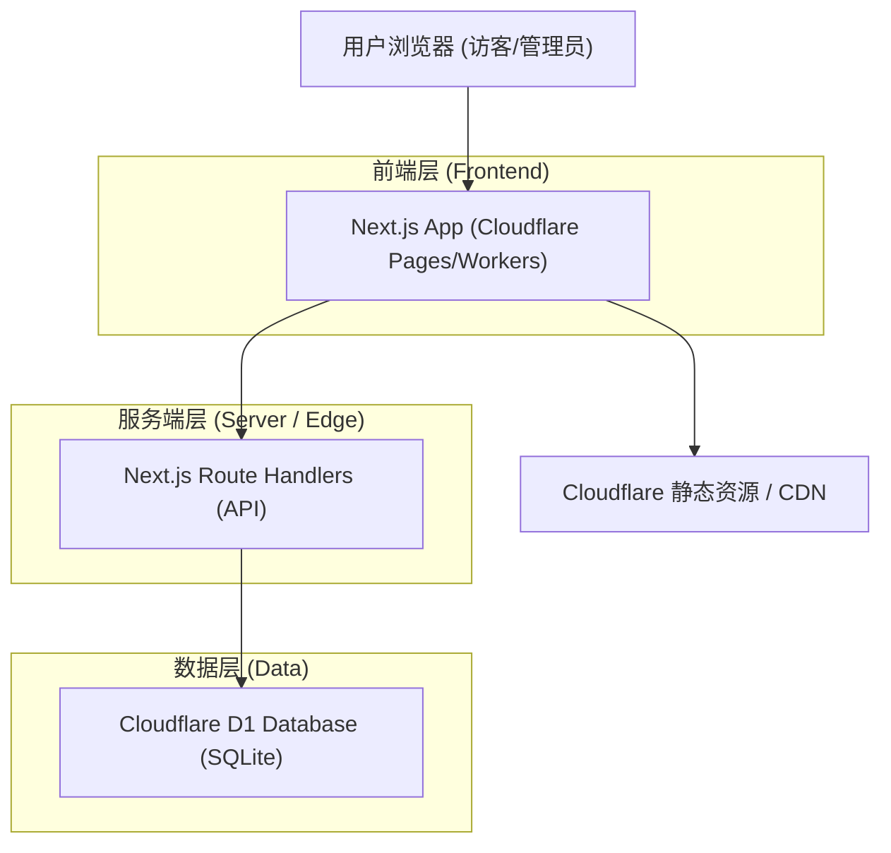
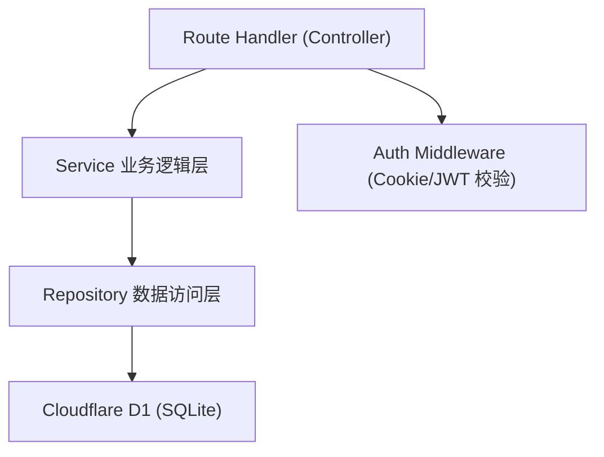
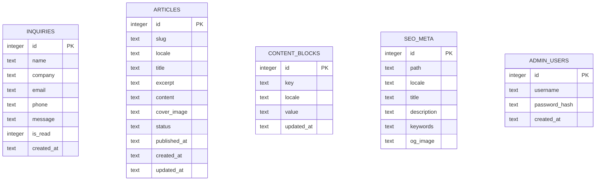

# NexShore Technologies 海外官网 — 技术架构文档

## 1. 架构设计



## 2. 技术说明

- **前端**：Next.js@14 (App Router) + React@18 + TypeScript + Tailwind CSS@3
- **UI 组件/图标**：lucide-react、framer-motion（动效）
- **部署平台**：Cloudflare Pages（通过 `@cloudflare/next-on-pages` 适配 Edge Runtime）
- **数据库**：Cloudflare D1（SQLite 兼容），通过 `D1Database` binding 在 Route Handlers 中访问
- **本地开发**：`wrangler` + `next dev`，本地 D1 使用 `wrangler d1` 模拟
- **认证**：管理后台基于 Cookie Session（JWT 签名存于 HttpOnly Cookie），密码使用 Web Crypto 哈希
- **SEO**：Next.js `generateMetadata` 动态生成 meta、`sitemap.ts`、`robots.ts`、JSON-LD 结构化数据
- **国际化**：基于路由前缀 `/[locale]`（en / zh），轻量自建 i18n 字典

## 3. 路由定义

### 前台路由（带语言前缀 `/[locale]`，默认 en）

| 路由 | 用途 |
|------|------|
| `/` 或 `/en` | 英文首页（默认） |
| `/zh` | 中文首页 |
| `/[locale]/about` | 关于我们 |
| `/[locale]/services` | 服务列表 |
| `/[locale]/services/[slug]` | 服务详情 |
| `/[locale]/why-us` | 为何选择我们 |
| `/[locale]/news` | 新闻列表 |
| `/[locale]/news/[slug]` | 新闻详情 |
| `/[locale]/contact` | 联系我们 / 询盘表单 |
| `/sitemap.xml` | 站点地图 |
| `/robots.txt` | 爬虫规则 |

### 后台路由

| 路由 | 用途 |
|------|------|
| `/admin/login` | 管理员登录 |
| `/admin` | 仪表盘 |
| `/admin/content` | 内容管理 (CMS) |
| `/admin/inquiries` | 询盘管理 |
| `/admin/news` | 新闻管理 |
| `/admin/news/edit/[id]` | 新闻编辑 |
| `/admin/seo` | SEO 设置 |

## 4. API 定义

所有 API 通过 Next.js Route Handlers (`app/api/.../route.ts`) 实现，运行于 Edge Runtime，访问 D1 binding。

### 4.1 询盘 Inquiry

```typescript
// POST /api/inquiries  (公开，提交询盘)
interface InquiryRequest {
  name: string;
  company?: string;
  email: string;
  phone?: string;
  message: string;
}
interface InquiryResponse {
  success: boolean;
  id?: number;
  error?: string;
}

// GET /api/inquiries  (需鉴权，列表)
// PATCH /api/inquiries/:id  { isRead: boolean }
// DELETE /api/inquiries/:id
```

### 4.2 认证 Auth

```typescript
// POST /api/auth/login
interface LoginRequest { username: string; password: string; }
interface LoginResponse { success: boolean; error?: string; }
// POST /api/auth/logout
```

### 4.3 新闻 Article

```typescript
// GET /api/articles?locale=en&page=1   (公开)
// GET /api/articles/:slug               (公开)
// POST /api/articles                    (需鉴权)
// PUT /api/articles/:id                 (需鉴权)
// DELETE /api/articles/:id              (需鉴权)
interface Article {
  id: number;
  slug: string;
  locale: string;
  title: string;
  excerpt: string;
  content: string;
  coverImage?: string;
  status: 'draft' | 'published';
  publishedAt?: string;
}
```

### 4.4 内容 Content (CMS)

```typescript
// GET /api/content/:key?locale=en   (公开读取)
// PUT /api/content/:key             (需鉴权，更新)
interface ContentBlock { key: string; locale: string; value: string; }
```

### 4.5 SEO 设置

```typescript
// GET /api/seo/:path?locale=en
// PUT /api/seo/:path
interface SeoMeta {
  path: string;
  locale: string;
  title: string;
  description: string;
  keywords?: string;
  ogImage?: string;
}
```

## 5. 服务端架构



## 6. 数据模型

### 6.1 数据模型定义



### 6.2 数据定义语言 (DDL)

```sql
-- 询盘表
CREATE TABLE IF NOT EXISTS inquiries (
  id INTEGER PRIMARY KEY AUTOINCREMENT,
  name TEXT NOT NULL,
  company TEXT,
  email TEXT NOT NULL,
  phone TEXT,
  message TEXT NOT NULL,
  is_read INTEGER NOT NULL DEFAULT 0,
  created_at TEXT NOT NULL DEFAULT (datetime('now'))
);
CREATE INDEX IF NOT EXISTS idx_inquiries_created ON inquiries(created_at DESC);

-- 文章表
CREATE TABLE IF NOT EXISTS articles (
  id INTEGER PRIMARY KEY AUTOINCREMENT,
  slug TEXT NOT NULL,
  locale TEXT NOT NULL DEFAULT 'en',
  title TEXT NOT NULL,
  excerpt TEXT,
  content TEXT NOT NULL,
  cover_image TEXT,
  status TEXT NOT NULL DEFAULT 'draft',
  published_at TEXT,
  created_at TEXT NOT NULL DEFAULT (datetime('now')),
  updated_at TEXT NOT NULL DEFAULT (datetime('now'))
);
CREATE UNIQUE INDEX IF NOT EXISTS idx_articles_slug_locale ON articles(slug, locale);
CREATE INDEX IF NOT EXISTS idx_articles_status ON articles(status, locale);

-- 内容块表（CMS）
CREATE TABLE IF NOT EXISTS content_blocks (
  id INTEGER PRIMARY KEY AUTOINCREMENT,
  key TEXT NOT NULL,
  locale TEXT NOT NULL DEFAULT 'en',
  value TEXT NOT NULL,
  updated_at TEXT NOT NULL DEFAULT (datetime('now'))
);
CREATE UNIQUE INDEX IF NOT EXISTS idx_content_key_locale ON content_blocks(key, locale);

-- SEO 元信息表
CREATE TABLE IF NOT EXISTS seo_meta (
  id INTEGER PRIMARY KEY AUTOINCREMENT,
  path TEXT NOT NULL,
  locale TEXT NOT NULL DEFAULT 'en',
  title TEXT NOT NULL,
  description TEXT,
  keywords TEXT,
  og_image TEXT
);
CREATE UNIQUE INDEX IF NOT EXISTS idx_seo_path_locale ON seo_meta(path, locale);

-- 管理员表
CREATE TABLE IF NOT EXISTS admin_users (
  id INTEGER PRIMARY KEY AUTOINCREMENT,
  username TEXT NOT NULL UNIQUE,
  password_hash TEXT NOT NULL,
  created_at TEXT NOT NULL DEFAULT (datetime('now'))
);

-- 初始管理员（密码: admin123，部署后请立即修改）
INSERT OR IGNORE INTO admin_users (username, password_hash)
VALUES ('admin', 'REPLACE_WITH_HASHED_PASSWORD');

-- 初始 SEO 数据
INSERT OR IGNORE INTO seo_meta (path, locale, title, description, keywords) VALUES
('/', 'en', 'NexShore Technologies — Your Bridge to Chinese Manufacturing', 'Technical consulting, sourcing, factory auditing and quality inspection services connecting global businesses with Chinese manufacturing.', 'sourcing, factory audit, quality inspection, China manufacturing, supplier identification'),
('/about', 'en', 'About Us — NexShore Technologies', 'Over 15 years of technical expertise bridging global companies with Chinese innovation and manufacturing capacity.', 'about NexShore, China sourcing company');
```

## 7. 项目结构

```
/
├── app/
│   ├── [locale]/              # 前台多语言页面
│   │   ├── page.tsx           # 首页
│   │   ├── about/page.tsx
│   │   ├── services/
│   │   ├── news/
│   │   └── contact/page.tsx
│   ├── admin/                 # 后台
│   │   ├── login/page.tsx
│   │   ├── page.tsx           # Dashboard
│   │   ├── inquiries/
│   │   ├── news/
│   │   ├── content/
│   │   └── seo/
│   ├── api/                   # Route Handlers
│   ├── sitemap.ts
│   └── robots.ts
├── components/                # 复用组件
├── lib/                       # db, auth, i18n 工具
├── i18n/                      # 语言字典
├── migrations/                # D1 SQL 迁移
├── wrangler.toml              # Cloudflare 配置
└── next.config.mjs
```

## 8. 部署说明

1. 创建 D1 数据库：`wrangler d1 create nexshore-db`
2. 配置 `wrangler.toml` 绑定 D1
3. 执行迁移：`wrangler d1 execute nexshore-db --file=./migrations/0001_init.sql`
4. 构建：`npx @cloudflare/next-on-pages`
5. 部署到 Cloudflare Pages（连接 Git 仓库自动部署或 `wrangler pages deploy`）
